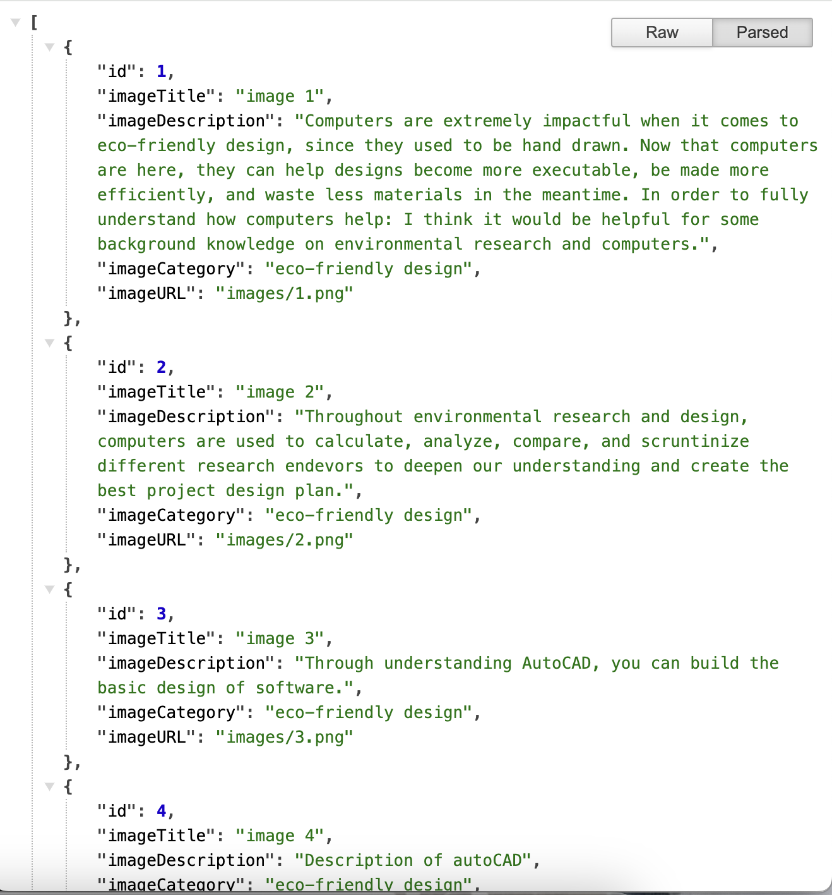

# Web_projectcs310.io
Web Project for Web Development Class

## Introduction:
Hello! Welcome to my documentation where I talk about my website Code Green! This website was built to be an informative website about the benefits and the positive impact computer science is having towards climate change and other environmental issues while also having images, sources for more information, and a natural-toned aesthetic. Through this website I hope to build more of a positive reputation behind the reasons to go into Computer Science.
## An instruction on importing the Database:
put in the following command to upload the database:
`sqlite3 database.db < schema.sql`

## Setting up the project on a local machine:
1. run the following command to install the following packages into packages.json file:
    - `npm install`
    - `npm install -g nodemon`
2. run the following command to start running the project:
    `nodemon server.js`
## API Documentation:
Here are the API's I used for this project:

- http://localhost:8080/images
    - Request Type: GET
    - Request Format: http://localhost:8080/images?cate=[category]
    - Request Parameters: 
        - `cate` is the required parameter, which can only use the following values:
        - "eco-friendly design"
        - "greenhouse emissions"
        - "solar power benefits"
        - "energy efficiency"
    - Returned Data: JSON format
    - Description: this is a get request to get the images associated with the category the user clicks.
        - Example: http://localhost:8080/images?cate=eco-friendly%20design
        - Returned result:
            
